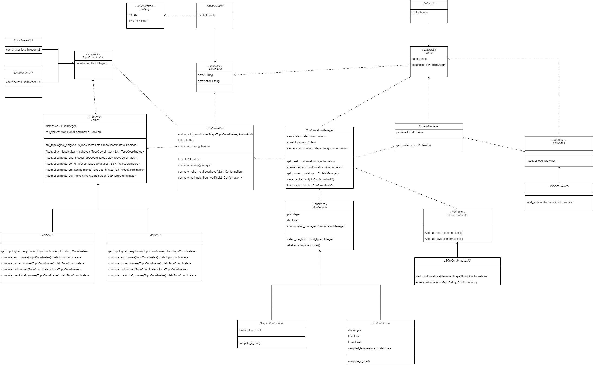

## Introduction

This repository contains an implementation of the Replica Exchange Monte Carlo (REMC) algorithm for solving the AB Initio protein folding problem. The REMC algorithm has been applied successfully in various computational biology and biophysics research, and this implementation allows you to explore its functionality using Python.

**Objective**

The primary objective of this project is to provide a Python implementation of the REMC algorithm as described in **[this paper](https://bmcbioinformatics.biomedcentral.com/articles/10.1186/1471-2105-8-342)** [1]. The AB Initio protein folding problem is a challenging task (proven to be NP-Hard) in the fields of biochemistry and molecular biology.

**Features**

- Implementation of REMC for AB Initio protein folding.
- Easy-to-understand Python code with comments for clarity.
- Ergonomic web interface to test the code.

**Prerequisites**

We highly recommand the use of the version **3.10.11** or newer of Python to run the project's code.

## Getting Started

You can install and run the code in various ways. This section describes three different ways to do so : by using **Docker**, **Conda** or the built-in python virtual environments.

### 1. Using Docker

You can easily run this project using Docker. Follow these steps:

- Install Docker on your system if you haven't already. You can download it [here](https://www.docker.com/get-started).
- Simply run :
  ```console
  docker-compose up --build
  ```

### 2. Using Conda

If you're more of a Conda user, follow these steps :

- Start by installing Anaconda or Miniconda if you haven't already.
- Create a virtual environment, activate it and upgrade pip :

  ```console
  conda create --name abinitio
  conda activate abinitio

  python -m pip install --upgrade pip
  ```

- Install the dependencies :
  ```console
  pip install .
  ```
- Run the server config (just the first time):
  ```console
  python server_config/config.py
  ```
- Run the app :
  ```console
  streamlit run run.py
  ```

### 3. Using Python Virtual Environments

If you opt to utilize the traditional Python virtual environments, please adhere to these steps:

- Create a virtual environment, activate it and update pip :

  ```console
  python -m venv abinitio

  source abinitio/bin/activate # Linux
  .\abinitio\Scripts\activate # Windows

  python -m pip install --upgrade pip
  ```

- Install the dependencies :
  ```console
  pip install .
  ```
- Run the server config (only the first time) :
  ```console
  python server_config/config.py
  ```
- Run the app :
  ```console
  streamlit run run.py
  ```

## Software Design Details

The code within this repository is based on the following class diagram (which I have created):



## License

This project is licensed under the MIT License - see the [LICENSE](LICENSE) file for details.

## References

Thachuk, C., Shmygelska, A. & Hoos, H.H. A replica exchange Monte Carlo algorithm for protein folding in the HP model. BMC Bioinformatics 8, 342 (2007). https://doi.org/10.1186/1471-2105-8-342
